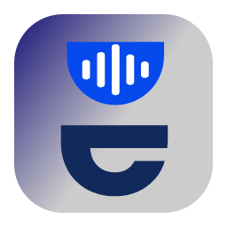
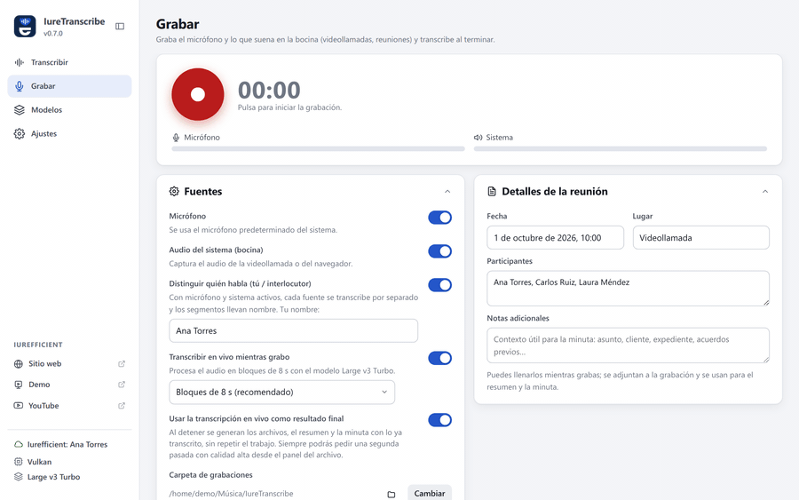
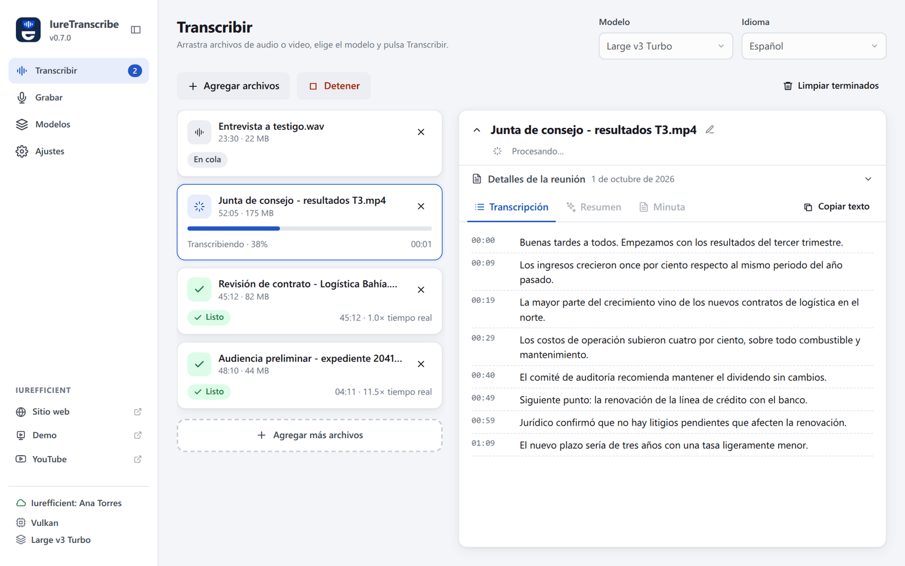
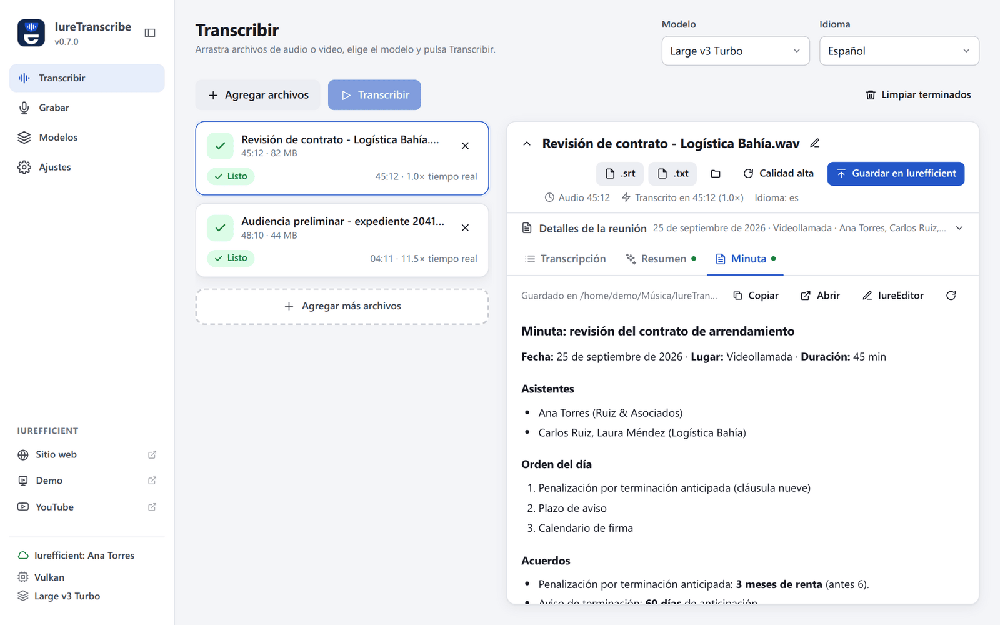
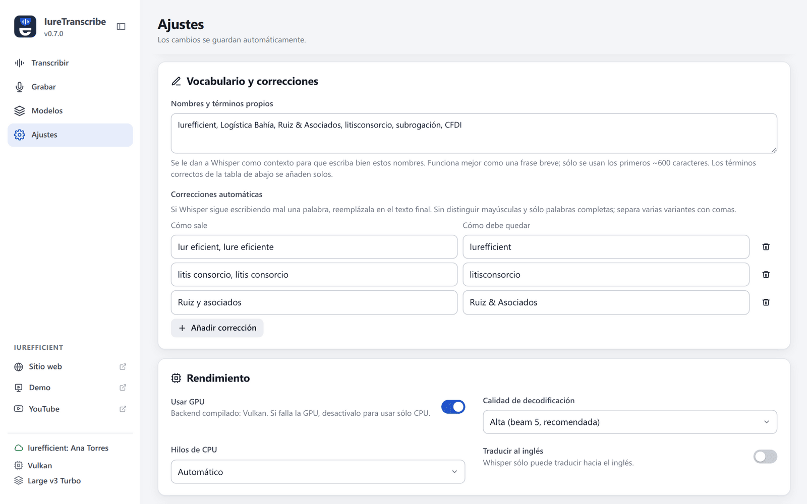
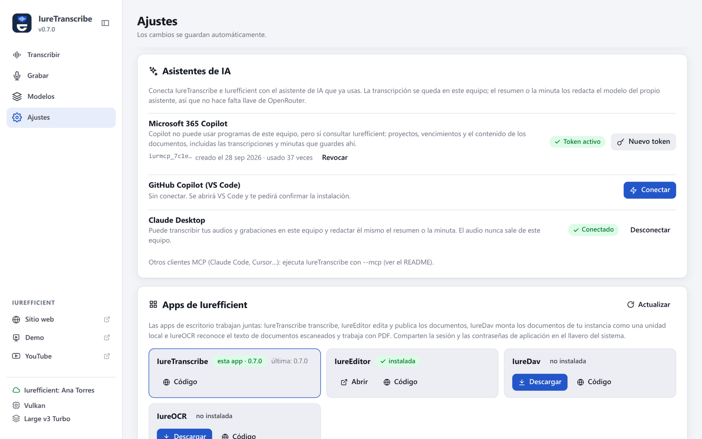
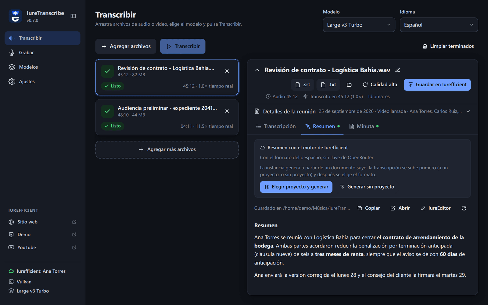

[Read in English](README.md)

<p align="center">
  
</p>
<h1 align="center">IureTranscribe</h1>
<p align="center">
  Transcribe juntas, llamadas y grabaciones en tu propio equipo con Whisper y obtén el resumen y la minuta, sin que el audio salga de la máquina.
</p>
<p align="center">
  <a href="https://github.com/ellaguno/iuretranscribe/releases/latest"></a>
  <a href="https://github.com/ellaguno/iuretranscribe/releases"></a>
  <a href="LICENSE"></a>
  
</p>
<p align="center">
  <a href="https://github.com/ellaguno/iuretranscribe/releases/latest"><strong>Descargar para Linux · Windows · macOS</strong></a>
</p>

<p align="center">
  
</p>

## ¿Por qué IureTranscribe?

- **Tu audio se queda en tu equipo.** La transcripción corre localmente con
  [whisper.cpp](https://github.com/ggerganov/whisper.cpp); no hace falta cuenta ni conexión a
  internet para transcribir. El instalador ya trae un modelo.
- **Graba la reunión por ti.** Micrófono y audio del sistema (videollamadas, reuniones en el
  navegador) con transcripción en vivo que dice **quién habló**: tú o el interlocutor.
- **Resumen y minuta en Markdown**, redactados por OpenRouter con tu propia llave, por tu
  instancia de Iurefficient o por el asistente de IA que ya usas (Claude, Copilot) vía MCP, sin
  ninguna llave.
- **Rápido en el equipo que tengas**: CUDA, Vulkan o Metal si hay GPU, y una variante CPU que
  funciona en cualquier máquina.
- Reemplaza con interfaz gráfica al script de línea de comandos `transcribe`. Libre y de código
  abierto (Apache 2.0).

## Capturas

<table>
  <tr>
    <td width="50%"></td>
    <td width="50%"></td>
  </tr>
  <tr>
    <td>Cola de archivos: progreso y segmentos en tiempo real.</td>
    <td>Minuta generada a partir de la transcripción y los detalles de la reunión.</td>
  </tr>
  <tr>
    <td width="50%"></td>
    <td width="50%"></td>
  </tr>
  <tr>
    <td>Vocabulario propio y correcciones automáticas.</td>
    <td>Conecta Claude Desktop, Copilot en VS Code o Microsoft 365 Copilot.</td>
  </tr>
</table>

<p align="center">
  
  <br><sub>Tema oscuro.</sub>
</p>

## Funciones

- Transcripción 100 % local con whisper.cpp. El instalador incluye el modelo Base para
  funcionar de inmediato; los demás modelos GGML (Large v3 Turbo recomendado) se descargan
  desde la propia app.
- Cola de archivos con arrastrar y soltar, progreso en vivo y segmentos en tiempo real.
- Salida en SRT, VTT, TXT y JSON, junto al archivo original o en una carpeta fija.
- Vocabulario propio (nombres y términos que se le dan a Whisper como contexto) y correcciones
  automáticas para las palabras que Whisper sigue escribiendo mal.
- Resumen y minuta en Markdown (OpenRouter, con instrucciones editables), con detalles de la
  reunión (participantes, fecha, lugar, notas) capturables en cualquier momento.
- Grabación integrada del micrófono y del audio del sistema con transcripción en vivo y, si
  ambas fuentes están activas, **quién habló**: cada fuente se transcribe por separado y los
  segmentos llevan tu nombre o «Interlocutor».
- Con la minuta generada por Iurefficient, **compromisos → tareas**: la app lee los compromisos
  que detecta la instancia, permite corregir responsable y fecha, y los crea como tareas del
  proyecto.
- Aceleración por GPU según la variante: CUDA (NVIDIA, Linux/Windows), Vulkan (AMD, Intel o
  NVIDIA, Linux/Windows) o Metal (Apple Silicon). La variante CPU funciona en cualquier equipo.
- Decodifica MP3, WAV, M4A/AAC, MP4, MOV, MKV, FLAC y OGG sin dependencias; si `ffmpeg` está
  instalado, también Opus, WebM y otros formatos.
- Interfaz en inglés y español: por defecto en inglés, en español si el sistema operativo está
  en español; se puede elegir en Ajustes → Idioma. El idioma de la interfaz es independiente del
  idioma del audio que se transcribe, y el resumen y la minuta se redactan en el idioma de la
  transcripción.

## Descargar e instalar

Descarga los archivos de la [última versión](https://github.com/ellaguno/iuretranscribe/releases/latest).
Cada nombre de archivo lleva la variante, p. ej. `IureTranscribe_0.7.0_1-windows-x64.exe`.

| Plataforma | Archivo | Notas |
| --- | --- | --- |
| Windows | `…windows-x64.exe` (instalador) o `…windows-x64.msi` | CPU, cualquier equipo |
| Windows | `…windows-x64-vulkan.exe` | GPU vía Vulkan (AMD, Intel, NVIDIA) |
| Windows | `…windows-x64-cuda.exe` | NVIDIA, con el runtime de CUDA 12 incluido |
| macOS | `…macos-arm64.dmg` | Apple Silicon, con Metal (macOS 12 o posterior) |
| macOS | `…macos-x64.dmg` | Mac con Intel, CPU |
| Linux | `…linux-x64.AppImage`, `.deb` o `.rpm` | CPU, cualquier equipo; el AppImage se actualiza solo |
| Linux | `…linux-x64-vulkan.AppImage`, `.deb` o `.rpm` | GPU vía Vulkan |
| Linux | `…linux-x64-cuda.deb` | NVIDIA, sólo `.deb` |

Los archivos `.sig`, `.app.tar.gz` y `latest.json` son para el actualizador de la app; no hace
falta descargarlos.

**Si no sabes qué tarjeta gráfica tiene el equipo, instala la variante sin GPU** (`linux-x64` o
`windows-x64`): funciona en cualquier máquina. Para un instalador ligero con GPU, usa la
variante Vulkan.

| Variante | GPU | Tamaño aproximado (v0.7.0) |
| --- | --- | --- |
| `linux-x64`, `windows-x64` | ninguna (CPU) | 130–220 MB |
| `linux-x64-vulkan`, `windows-x64-vulkan` | AMD, Intel, NVIDIA (Vulkan) | 140–225 MB |
| `linux-x64-cuda`, `windows-x64-cuda` | NVIDIA (CUDA 12) | 710–870 MB (incluye cuBLAS) |
| `macos-arm64` | Apple Silicon (Metal) | 140 MB |
| `macos-x64` | ninguna (CPU) | 140 MB |

Casi todo el tamaño de cada instalador es el modelo Base incluido (unos 140 MB). Las variantes
CUDA incluyen el runtime de CUDA 12 (`cudart`, `cublas`, `cublasLt`) dentro del instalador, así
que sólo necesitan el driver de NVIDIA; `cublasLt` es lo que ocupa casi todo el tamaño extra y
no se puede omitir. En Linux CUDA se distribuye sólo como `.deb` (el AppImage no puede
empaquetar esas librerías).

Las variantes CUDA y Vulkan comprueban la GPU la primera vez que van a transcribir, en un
proceso aparte (`--gpu-probe`), porque un driver que no sirve hace que ggml aborte el proceso
en vez de devolver un error. Si la GPU falla, siguen con el procesador y lo avisan en la barra
lateral con un enlace a la versión sin GPU; si ni siquiera el modo procesador arranca, la
transcripción se detiene con ese mismo aviso en lugar de cerrar la aplicación sin rastro.

**Los instaladores no están firmados**, así que el sistema avisa la primera vez:

- **Windows**: SmartScreen puede mostrar «Windows protegió su PC» / editor desconocido. Pulsa
  **Más información → Ejecutar de todas formas**.
- **macOS**: la app no está notarizada. Clic derecho sobre la app → **Abrir**, o ve a Ajustes
  del Sistema → Privacidad y seguridad → **Abrir de todos modos**. Si macOS dice que la app
  «está dañada», ejecuta `xattr -dr com.apple.quarantine /Applications/IureTranscribe.app`.
- **Linux**: haz ejecutable el AppImage (`chmod +x IureTranscribe_*.AppImage`) o instala el
  `.deb`/`.rpm` con tu gestor de paquetes.

En [Política de firma de código](#política-de-firma-de-código) se explica cómo se generan los
archivos.

## Conexión con Iurefficient

En Ajustes → Cuenta de Iurefficient se indica el dominio de la instancia, el correo y una
**contraseña de aplicación** (`iurdav_…`, la misma que usa IureDav; la genera cada usuario en
su perfil y requiere que un administrador tenga WebDAV activado). Con la cuenta conectada, cada
archivo transcrito tiene el botón **Guardar en Iurefficient**: se elige la carpeta del cliente
y proyecto (o `General`) y se suben la transcripción (SRT/TXT/…), el resumen, la minuta y,
opcionalmente, el audio o video original. Un archivo con el mismo nombre se guarda como versión
nueva, no como duplicado, igual que en la aplicación web. Las instancias no admiten
`.srt`/`.vtt` por defecto: en ese caso se suben como `.txt` (p. ej. `reunion.srt.txt`).

Además, con **sesión iniciada** (tu contraseña normal de Iurefficient, con verificación en dos
pasos si la tienes; la sesión se guarda en el llavero y dura 30 días) el mismo botón ofrece dos
destinos más:

- **Proyecto**: busca el proyecto o caso, sube los archivos como documentos del expediente y,
  si quieres, registra las horas de la reunión como tiempo facturable. Después, en la pestaña
  Minuta, «Minuta con el motor de Iurefficient» lista los formatos (blueprints) del despacho y
  genera el documento en la instancia, con los asistentes y detalles capturados, sin necesidad
  de llave de OpenRouter.
- **CRM**: adjunta los archivos a una oportunidad o lead y registra una actividad de reunión
  con la duración y el resumen.

El conector es el crate común [`iurefficient-connect`](https://github.com/ellaguno/iurefficient-connect),
compartido con IureEditor, IureDav e IureOCR; las credenciales viven en el llavero del sistema
(la misma entrada de contraseña WebDAV que usa IureDav), no en el archivo de ajustes.

## Uso desde Claude, Copilot y otros agentes (MCP)

`IureTranscribe --mcp` arranca un servidor [MCP](https://modelcontextprotocol.io) por stdio,
sin ventana. Claude Desktop, Claude Code, Copilot en VS Code o cualquier cliente MCP puede
transcribir con el Whisper de este equipo, y el modelo del propio cliente redacta el resumen o
la minuta: **no hace falta llave de OpenRouter**. El audio nunca sale del equipo; sólo el texto
que el agente decide leer.

| Herramienta | Qué hace |
| --- | --- |
| `transcribe_file` | Transcribe un audio o video, escribe los archivos (SRT/TXT… según Ajustes) junto al audio y devuelve el texto; con `timestamps`, cada línea con su hora |
| `transcription_status` | Si la transcripción es larga, `transcribe_file` devuelve un `jobId` a los ~50 s y el trabajo sigue: esta herramienta espera y devuelve el texto; también lee el resto con `offset` |
| `read_transcript` | Lee una transcripción o una minuta ya existente, por partes |
| `audio_info` | Duración, tamaño y transcripciones que ya existen de un archivo |
| `list_recordings` | Las últimas grabaciones hechas con la app, con su duración y si ya están transcritas |
| `transcription_setup` | Modelo, idioma, formatos y modelos descargados |

Usa el modelo, el idioma, el vocabulario propio y las correcciones de Ajustes. El modelo tiene
que estar descargado (sección Modelos). El registro va a `iuretranscribe-mcp.log`.

En **Ajustes → Asistentes de IA** la app detecta qué asistentes hay y conecta cada uno:

- **Microsoft 365 Copilot** no puede usar programas del equipo, pero sí el servidor MCP de la
  instancia. Con la sesión iniciada, **Crear acceso para Copilot** genera un token `iurmcp_…`
  (un año) y muestra la URL y los pasos para Copilot Studio (encabezado `X-MCP-Token`). Para que
  Copilot lea una reunión, hay que guardar en Iurefficient su transcripción o su minuta. Los
  tokens se revocan desde la misma fila.
- **GitHub Copilot en VS Code**: **Conectar** abre el enlace `vscode:mcp/install?…`; VS Code
  pide confirmación y guarda el servidor.
- **Claude Desktop**: **Conectar** agrega la entrada a `claude_desktop_config.json` sin tocar
  el resto (deja una copia `.bak-iuretranscribe`). Después hay que cerrar y abrir Claude
  Desktop.

Para otros clientes: `claude mcp add iuretranscribe -- /ruta/a/IureTranscribe --mcp` en Claude
Code, o la salida de `IureTranscribe --mcp-config` en su configuración.

## Grabación

| Plataforma | Micrófono | Audio del sistema (bocina) |
| --- | --- | --- |
| Linux | PipeWire (`pw-record`) o PulseAudio (`parec`) | Monitor de la salida predeterminada |
| Windows | WASAPI (cpal) | Loopback WASAPI de la salida predeterminada |
| macOS | CoreAudio (cpal) | Requiere un dispositivo virtual (p. ej. BlackHole) elegido como micrófono |

Las grabaciones se guardan como WAV mono de 16 kHz en `Música/IureTranscribe` (configurable) y,
si así se indica, se agregan a la cola y se transcriben solas.

## Parte de la suite Iurefficient

| App | Qué hace |
| --- | --- |
| **IureTranscribe** | Transcripción local con Whisper, grabación en vivo con quién habló, resumen y minuta. |
| [IureEditor](https://github.com/ellaguno/iureditor) | Editor Markdown WYSIWYG con Mermaid, LaTeX y exportación a PDF/DOCX. |
| [IureDav](https://github.com/ellaguno/iuredav) | Monta un servidor WebDAV (o Iurefficient) como unidad. |
| [IureOCR](https://github.com/ellaguno/iureocr) | OCR local que convierte escaneos en PDF con texto buscable. |
| [iureTI](https://github.com/ellaguno/iureTI) | Sonda de descubrimiento de activos de TI para el inventario de Iurefficient. |

## Contribuir

Los issues y pull requests son bienvenidos. Buenas primeras contribuciones:

- **Reportes de errores con el archivo de registro** adjunto (su ruta aparece en Ajustes y en
  «Dónde guarda las cosas», dentro de [Detalles técnicos](#detalles-técnicos)).
- **Traducciones**: los textos de la interfaz están en `src/lib/i18n.svelte.ts`; un idioma
  nuevo es un diccionario nuevo ahí.
- **Documentación**: correcciones e instrucciones más claras en este README.

Para compilar la app, consulta «Desarrollo» en [Detalles técnicos](#detalles-técnicos).

## Detalles técnicos

<details>
<summary><strong>Stack</strong></summary>

| Capa | Tecnología |
| --- | --- |
| Shell de escritorio | [Tauri 2](https://tauri.app) (Rust + WebView del sistema) |
| Motor de transcripción | whisper.cpp vía [`whisper-rs`](https://crates.io/crates/whisper-rs) |
| Decodificación de audio | [`symphonia`](https://crates.io/crates/symphonia) + remuestreo propio, con fallback a `ffmpeg` |
| Interfaz | Svelte 5 + Vite, TypeScript |
| Resumen/minuta | OpenRouter (API compatible con OpenAI) vía `reqwest` |

</details>

<details>
<summary><strong>Desarrollo</strong></summary>

Requisitos: Node 22+, Rust estable, CMake, un compilador C++ y **libclang** (lo usa `bindgen`
para generar los bindings de whisper.cpp). En Linux además los
[prerrequisitos de Tauri](https://tauri.app/start/prerequisites/).

```bash
# Ubuntu / Debian
sudo apt install build-essential cmake libclang-dev libwebkit2gtk-4.1-dev librsvg2-dev patchelf libssl-dev
# Sin sudo: pip install --user libclang  y  export LIBCLANG_PATH=$(python3 -c 'import clang.native,os;print(os.path.dirname(clang.native.__file__))')
# macOS: xcode-select --install && brew install cmake llvm
# Windows: Visual Studio Build Tools (C++), CMake y LLVM (winget install LLVM.LLVM)
```

```bash
npm install
npm run tauri dev                      # CPU
npm run tauri dev -- --features cuda   # NVIDIA (requiere CUDA Toolkit / nvcc)
npm run tauri dev -- --features metal  # macOS Apple Silicon / Intel con Metal
npm run tauri dev -- --features vulkan # AMD / Intel / NVIDIA vía Vulkan (requiere Vulkan SDK)
```

Instaladores:

```bash
npm run tauri build -- --features cuda   # .deb/.rpm/.AppImage, .msi/.exe o .dmg según el sistema
```

Las features de GPU son de compilación: el binario resultante muestra el backend en la barra
lateral y en Ajustes. Si la GPU falla en tiempo de ejecución, desactiva «Usar GPU» en Ajustes
para caer a CPU.

Las capturas y el GIF de este README se generan desde la interfaz real con
[`scripts/readme-media/`](scripts/readme-media/README.md).

</details>

<details>
<summary><strong>CI</strong></summary>

`.github/workflows/build.yml` compila en cada push y, al crear una etiqueta `vX.Y.Z`, publica
una release con instaladores para Linux (CPU, CUDA y Vulkan), Windows (CPU, CUDA y Vulkan) y
macOS (Apple Silicon con Metal e Intel). Los artefactos de cada push (sin etiqueta) quedan en la
pestaña Actions del repositorio.

</details>

<details>
<summary><strong>Actualizaciones</strong></summary>

Al arrancar, la app consulta las releases de GitHub. Si la instalación lo permite (AppImage en
Linux, Windows, macOS) ofrece descargar e instalar la nueva versión dentro de la app, con
artefactos firmados (`latest.json` por plataforma y variante); con `.deb`/`.rpm` sólo avisa y
enlaza la descarga. Se puede desactivar en Ajustes → Apariencia → «Avisar de versiones nuevas».

</details>

<details>
<summary><strong>Dónde guarda las cosas</strong></summary>

| Qué | Linux | Windows | macOS |
| --- | --- | --- | --- |
| Modelos | `~/.local/share/com.iurefficient.iuretranscribe/models` | `%APPDATA%\com.iurefficient.iuretranscribe\models` | `~/Library/Application Support/com.iurefficient.iuretranscribe/models` |
| Ajustes | `~/.config/com.iurefficient.iuretranscribe/settings.json` | `%APPDATA%\com.iurefficient.iuretranscribe\settings.json` | `~/Library/Application Support/com.iurefficient.iuretranscribe/settings.json` |
| Registro | `~/.local/share/com.iurefficient.iuretranscribe/logs/iuretranscribe.log` | `%APPDATA%\com.iurefficient.iuretranscribe\logs\iuretranscribe.log` | `~/Library/Application Support/com.iurefficient.iuretranscribe/logs/iuretranscribe.log` |

El registro se reinicia en cada arranque y el anterior queda como `iuretranscribe.prev.log`. Si
la app se cierra sola, lo último que escribió está ahí; la ruta exacta se muestra en Ajustes.
Con la variable `RUST_LOG=debug` se escribe más detalle.

En Linux, la primera vez importa `OPENROUTER_API_KEY` y `OPENROUTER_MODEL` de
`~/.config/transcribe/config` si existen (el archivo del script original).

</details>

## Política de firma de código

Por ahora los instaladores de Windows y macOS **no están firmados**: SmartScreen de Windows
puede mostrar el aviso de editor desconocido, y macOS pide confirmación la primera vez porque la
app no está notarizada (los pasos están en [Descargar e instalar](#descargar-e-instalar)).

- Todos los instaladores los compila GitHub Actions a partir de este repositorio
  (`.github/workflows/build.yml`) y sólo se publican en la
  [página de releases](https://github.com/ellaguno/iuretranscribe/releases). Descárgalos de ahí.
- Lo que **sí** está firmado: los paquetes de actualización (`.AppImage`, el `-setup.exe` de
  Windows y el `.app.tar.gz` de macOS) llevan firma del actualizador de Tauri (`.sig`, listada en
  `latest.json`). La app la verifica con la llave pública que trae integrada antes de instalar
  una actualización, así que rechaza cualquier actualización que no haya salido de ese workflow.
- **Mantenedor:** Eduardo Llaguno ([@ellaguno](https://github.com/ellaguno)).

### Política de privacidad

Este programa no transfiere información a otros sistemas en red salvo que lo pida
expresamente el usuario o la persona que lo instala u opera.

La transcripción corre por completo en el equipo del usuario con [whisper.cpp](https://github.com/ggml-org/whisper.cpp);
el audio nunca sale de la máquina. En concreto, IureTranscribe sólo se conecta a:

- `huggingface.co`, cuando el usuario pide descargar un modelo de Whisper en la sección Modelos;
- la instancia de Iurefficient que configure el usuario, y sólo cuando inicia sesión, guarda ahí
  una transcripción o le pide a esa instancia redactar un resumen o una minuta;
- [OpenRouter](https://openrouter.ai), sólo si el usuario captura su propia llave de API y pide
  con ella un resumen o una minuta; el texto de la transcripción se envía sólo para esa
  solicitud;
- GitHub (`api.github.com`, `github.com`), para comprobar si hay una versión nueva: una vez al
  arrancar, lo cual se puede desactivar en Ajustes («Avisar de versiones nuevas»), y cuando
  Ajustes → Apps de Iurefficient muestra la última versión de cada app. Las actualizaciones se
  descargan de la página de releases sólo cuando el usuario las acepta.

No recopila telemetría ni estadísticas de uso. Las credenciales se guardan en el llavero del
sistema operativo, nunca en archivos de configuración.

## Licencia

Apache License 2.0 — ver [LICENSE](LICENSE).
