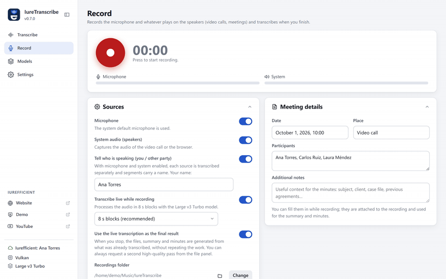
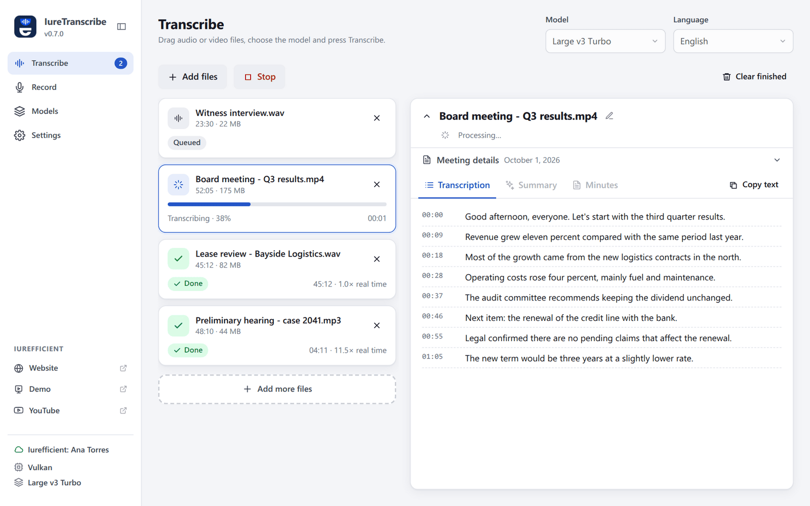
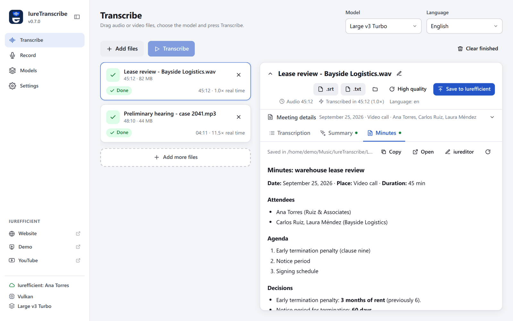
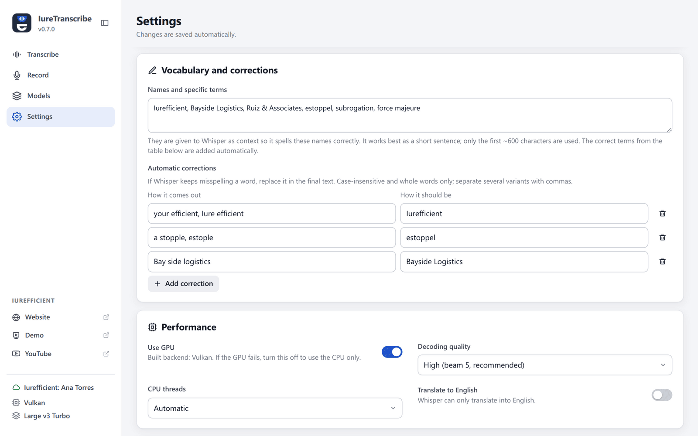
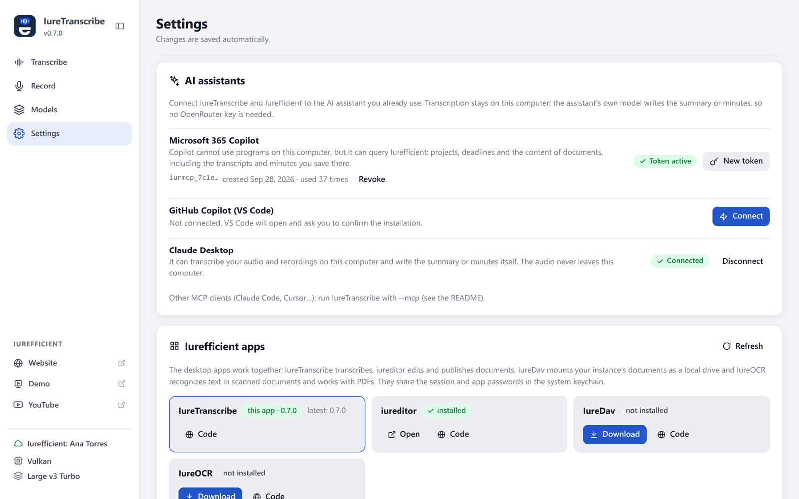
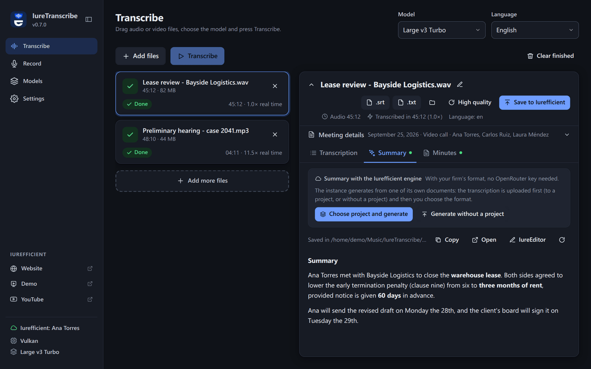

[Leer en español](README.es.md)

<p align="center">
  
</p>
<h1 align="center">IureTranscribe</h1>
<p align="center">
  Transcribe meetings, calls and recordings on your own computer with Whisper, and get the summary and minutes, without your audio leaving the machine.
</p>
<p align="center">
  <a href="https://github.com/ellaguno/iuretranscribe/releases/latest"></a>
  <a href="https://github.com/ellaguno/iuretranscribe/releases"></a>
  <a href="LICENSE"></a>
  
</p>
<p align="center">
  <a href="https://github.com/ellaguno/iuretranscribe/releases/latest"><strong>Download for Linux · Windows · macOS</strong></a>
</p>

<p align="center">
  
</p>

## Why IureTranscribe

- **Your audio stays on your computer.** Transcription runs locally with
  [whisper.cpp](https://github.com/ggerganov/whisper.cpp); no account and no internet
  connection are needed to transcribe. The installer already includes a model.
- **Records the meeting for you.** Microphone and system audio (video calls, meetings in the
  browser) with a live transcript that says **who spoke**: you or the other party.
- **Summary and minutes in Markdown**, written by OpenRouter with your own key, by your
  Iurefficient instance, or by the AI assistant you already use (Claude, Copilot) through MCP,
  with no key at all.
- **Fast on whatever machine you have**: CUDA, Vulkan or Metal when there is a GPU, and a CPU
  variant that runs anywhere.
- A graphical replacement for the `transcribe` command-line script. Free and open source
  (Apache 2.0).

## Screenshots

<table>
  <tr>
    <td width="50%"></td>
    <td width="50%"></td>
  </tr>
  <tr>
    <td>File queue: progress and segments in real time.</td>
    <td>Minutes generated from the transcript and the meeting details.</td>
  </tr>
  <tr>
    <td width="50%"></td>
    <td width="50%"></td>
  </tr>
  <tr>
    <td>Custom vocabulary and automatic corrections.</td>
    <td>Connect Claude Desktop, Copilot in VS Code or Microsoft 365 Copilot.</td>
  </tr>
</table>

<p align="center">
  
  <br><sub>Dark theme.</sub>
</p>

## Features

- 100% local transcription with whisper.cpp. The installer includes the Base model so it
  works right away; the other GGML models (Large v3 Turbo recommended) are downloaded from
  within the app.
- File queue with drag and drop, live progress and real-time segments.
- Output as SRT, VTT, TXT and JSON, next to the original file or in a fixed folder.
- Custom vocabulary (names and terms given to Whisper as context) and automatic corrections
  for words Whisper keeps misspelling.
- Summary and minutes in Markdown (OpenRouter, with editable instructions), with meeting
  details (participants, date, place, notes) that can be entered at any time.
- Built-in recording of the microphone and the system audio with live transcription and,
  when both sources are enabled, **who spoke**: each source is transcribed separately and the
  segments carry your name or “Other party”.
- Offline **speaker identification** (a ~34 MB add-on in Models): tells the voices apart in
  any audio (“Speaker 1”, “Speaker 2”…). In recordings with microphone and system audio, you
  stay apart and the voices coming from the speakers are separated from each other (“Other
  party 1”, “Other party 2”…). It uses pyannote 3.0 segmentation and voiceprints with
  [sherpa-onnx](https://github.com/k2-fsa/sherpa-onnx), in a separate executable.
- With the minutes generated by Iurefficient, **commitments → tasks**: the app reads the
  commitments the instance detects, lets you fix the assignee and date, and creates them as
  project tasks.
- GPU acceleration depending on the variant: CUDA (NVIDIA, Linux/Windows), Vulkan (AMD,
  Intel or NVIDIA, Linux/Windows) or Metal (Apple Silicon). The CPU variant works on any
  computer.
- Decodes MP3, WAV, M4A/AAC, MP4, MOV, MKV, FLAC and OGG with no dependencies; if `ffmpeg`
  is installed, also Opus, WebM and other formats.
- English and Spanish interface: English by default, Spanish when the operating system is in
  Spanish; it can be chosen in Settings → Language. The interface language is independent of
  the language of the audio being transcribed, and the summary and minutes are written in the
  language of the transcription.

## Download and install

Get the files from the [latest release](https://github.com/ellaguno/iuretranscribe/releases/latest).
Each file name carries the variant, e.g. `IureTranscribe_0.7.0_1-windows-x64.exe`.

| Platform | File | Notes |
| --- | --- | --- |
| Windows | `…windows-x64.exe` (installer) or `…windows-x64.msi` | CPU, any computer |
| Windows | `…windows-x64-vulkan.exe` | GPU via Vulkan (AMD, Intel, NVIDIA) |
| Windows | `…windows-x64-cuda.exe` | NVIDIA with CUDA 12 runtime included |
| macOS | `…macos-arm64.dmg` | Apple Silicon, with Metal (macOS 12 or later) |
| macOS | `…macos-x64.dmg` | Intel Macs, CPU |
| Linux | `…linux-x64.AppImage`, `.deb` or `.rpm` | CPU, any computer; the AppImage updates itself |
| Linux | `…linux-x64-vulkan.AppImage`, `.deb` or `.rpm` | GPU via Vulkan |
| Linux | `…linux-x64-cuda.deb` | NVIDIA, `.deb` only |

The `.sig`, `.app.tar.gz` and `latest.json` files are for the in-app updater; you don't need
to download them.

**If you don't know which graphics card the computer has, install the variant without GPU**
(`linux-x64` or `windows-x64`): it works on any machine. For a lightweight installer with GPU,
use the Vulkan variant.

| Variant | GPU | Approximate size (v0.7.0) |
| --- | --- | --- |
| `linux-x64`, `windows-x64` | none (CPU) | 130–220 MB |
| `linux-x64-vulkan`, `windows-x64-vulkan` | AMD, Intel, NVIDIA (Vulkan) | 140–225 MB |
| `linux-x64-cuda`, `windows-x64-cuda` | NVIDIA (CUDA 12) | 710–870 MB (includes cuBLAS) |
| `macos-arm64` | Apple Silicon (Metal) | 140 MB |
| `macos-x64` | none (CPU) | 140 MB |

Most of the size of every installer is the bundled Base model (about 140 MB). The CUDA
variants include the CUDA 12 runtime (`cudart`, `cublas`, `cublasLt`) inside the installer,
so they only need the NVIDIA driver; `cublasLt` is what takes up almost all the extra size and
cannot be left out. On Linux CUDA is distributed only as `.deb` (the AppImage cannot bundle
those libraries).

The CUDA and Vulkan variants check the GPU the first time they are about to transcribe, in a
separate process (`--gpu-probe`), because a driver that does not work makes ggml abort the
process instead of returning an error. If the GPU fails, they continue with the CPU and say so
in the sidebar with a link to the version without GPU; if not even CPU mode starts, the
transcription stops with that same notice instead of closing the application without a trace.

**The installers are not code-signed**, so the system warns the first time:

- **Windows**: SmartScreen may show “Windows protected your PC” / unknown publisher. Click
  **More info → Run anyway**.
- **macOS**: the app is not notarized. Right-click the app → **Open**, or go to System
  Settings → Privacy & Security → **Open Anyway**. If macOS says the app “is damaged”, run
  `xattr -dr com.apple.quarantine /Applications/IureTranscribe.app`.
- **Linux**: make the AppImage executable (`chmod +x IureTranscribe_*.AppImage`) or install
  the `.deb`/`.rpm` with your package manager.

See [Code signing policy](#code-signing-policy) for how the files are built.

## Connecting to Iurefficient

In Settings → Iurefficient account you enter the instance domain, the email and an **app
password** (`iurdav_…`, the same one IureDav uses; each user generates it in their profile and
it requires an administrator to have WebDAV enabled). With the account connected, every
transcribed file has a **Save to Iurefficient** button: you choose the client and project
folder (or `General`) and the transcription (SRT/TXT/…), the summary, the minutes and,
optionally, the original audio or video are uploaded. A file with the same name is saved as a
new version, not as a duplicate, just like in the web application. Instances do not accept
`.srt`/`.vtt` by default: in that case they are uploaded as `.txt` (e.g. `meeting.srt.txt`).

In addition, when **signed in** (your regular Iurefficient password, with two-step
verification if you have it; the session is stored in the keychain and lasts 30 days) the same
button offers two more destinations:

- **Project**: search for the project or case, upload the files as documents of the case file
  and, if you want, log the meeting hours as billable time. Afterwards, in the Minutes tab,
  “Minutes with the Iurefficient engine” lists your firm's formats (blueprints) and generates
  the document on the instance, with the attendees and details you entered, without needing an
  OpenRouter key.
- **CRM**: attaches the files to an opportunity or lead and logs a meeting activity with the
  duration and the summary.

The connector is the shared [`iurefficient-connect`](https://github.com/ellaguno/iurefficient-connect)
crate, shared with iureditor, IureDav and IureOCR; credentials live in the system keychain
(the same WebDAV password entry that IureDav uses), not in the settings file.

## Use from Claude, Copilot and other agents (MCP)

`IureTranscribe --mcp` starts an [MCP](https://modelcontextprotocol.io) server over stdio,
with no window. Claude Desktop, Claude Code, Copilot in VS Code or any MCP client can
transcribe with this computer's Whisper, and the client's own model writes the summary or
minutes: **no OpenRouter key is needed**. The audio never leaves the computer; only the text
the agent chooses to read does.

| Tool | What it does |
| --- | --- |
| `transcribe_file` | Transcribes an audio or video file, writes the files (SRT/TXT… as set in Settings) next to it and returns the text; with `timestamps`, each line with its time |
| `transcription_status` | For long files, `transcribe_file` returns a `jobId` after ~50 s and the job keeps running: this tool waits and returns the text; it also reads the rest with `offset` |
| `read_transcript` | Reads an existing transcript or minutes, in parts |
| `audio_info` | Duration, size and existing transcripts of a file |
| `list_recordings` | The latest recordings made with the app, with duration and whether they are transcribed |
| `transcription_setup` | Model, language, formats and downloaded models |

It uses the model, language, custom vocabulary and corrections from Settings. The model must
be downloaded (Models section). The log goes to `iuretranscribe-mcp.log`.

In **Settings → AI assistants** the app detects which assistants are installed and connects
each one:

- **Microsoft 365 Copilot** cannot use programs on the computer, but it can use the instance's
  MCP server. While signed in, **Create access for Copilot** generates an `iurmcp_…` token
  (one year) and shows the URL and the steps for Copilot Studio (`X-MCP-Token` header). To let
  Copilot read a meeting, save its transcript or minutes to Iurefficient. Tokens are revoked
  from the same row.
- **GitHub Copilot in VS Code**: **Connect** opens the `vscode:mcp/install?…` link; VS Code
  asks for confirmation and saves the server.
- **Claude Desktop**: **Connect** adds the entry to `claude_desktop_config.json` without
  touching anything else (a `.bak-iuretranscribe` copy is kept). Then quit and reopen Claude
  Desktop.

Other clients: `claude mcp add iuretranscribe -- /path/to/IureTranscribe --mcp` in Claude
Code, or the output of `IureTranscribe --mcp-config` in their configuration.

## Recording

| Platform | Microphone | System audio (speakers) |
| --- | --- | --- |
| Linux | PipeWire (`pw-record`) or PulseAudio (`parec`) | Monitor of the default output |
| Windows | WASAPI (cpal) | WASAPI loopback of the default output |
| macOS | CoreAudio (cpal) | Requires a virtual device (e.g. BlackHole) chosen as the microphone |

Recordings are saved as 16 kHz mono WAV in `Music/IureTranscribe` (configurable) and, if so
configured, are added to the queue and transcribed automatically.

## Part of the Iurefficient suite

| App | What it does |
| --- | --- |
| **IureTranscribe** | Local Whisper transcription, live recording with who-spoke, summaries and minutes. |
| [iureditor](https://github.com/ellaguno/iureditor) | WYSIWYG Markdown editor with Mermaid, LaTeX and PDF/DOCX export. |
| [IureDav](https://github.com/ellaguno/iuredav) | Mount a WebDAV server (or Iurefficient) as a drive. |
| [IureOCR](https://github.com/ellaguno/iureocr) | Local OCR that turns scans into searchable PDFs. |
| [iureTI](https://github.com/ellaguno/iureTI) | IT asset discovery probe for the Iurefficient inventory. |

## Contributing

Issues and pull requests are welcome. Good first contributions:

- **Bug reports with the log file** attached (its path is shown in Settings and under
  “Where it stores things” in [Technical details](#technical-details)).
- **Translations**: the interface strings live in `src/lib/i18n.svelte.ts`; a new UI language
  is a new dictionary there.
- **Documentation**: corrections and clearer instructions in this README.

To build the app, see “Development” under [Technical details](#technical-details).

## Technical details

<details>
<summary><strong>Stack</strong></summary>

| Layer | Technology |
| --- | --- |
| Desktop shell | [Tauri 2](https://tauri.app) (Rust + system WebView) |
| Transcription engine | whisper.cpp via [`whisper-rs`](https://crates.io/crates/whisper-rs) |
| Audio decoding | [`symphonia`](https://crates.io/crates/symphonia) + own resampling, with `ffmpeg` fallback |
| Interface | Svelte 5 + Vite, TypeScript |
| Summary/minutes | OpenRouter (OpenAI-compatible API) via `reqwest` |

</details>

<details>
<summary><strong>Development</strong></summary>

Requirements: Node 22+, stable Rust, CMake, a C++ compiler and **libclang** (used by `bindgen`
to generate the whisper.cpp bindings). On Linux also the
[Tauri prerequisites](https://tauri.app/start/prerequisites/).

```bash
# Ubuntu / Debian
sudo apt install build-essential cmake libclang-dev libwebkit2gtk-4.1-dev librsvg2-dev patchelf libssl-dev
# Without sudo: pip install --user libclang  and  export LIBCLANG_PATH=$(python3 -c 'import clang.native,os;print(os.path.dirname(clang.native.__file__))')
# macOS: xcode-select --install && brew install cmake llvm
# Windows: Visual Studio Build Tools (C++), CMake and LLVM (winget install LLVM.LLVM)
```

```bash
npm install
npm run tauri dev                      # CPU
npm run tauri dev -- --features cuda   # NVIDIA (requires CUDA Toolkit / nvcc)
npm run tauri dev -- --features metal  # macOS Apple Silicon / Intel with Metal
npm run tauri dev -- --features vulkan # AMD / Intel / NVIDIA via Vulkan (requires Vulkan SDK)
```

Installers:

```bash
npm run tauri build -- --features cuda   # .deb/.rpm/.AppImage, .msi/.exe or .dmg depending on the system
```

The GPU features are compile-time: the resulting binary shows the backend in the sidebar and
in Settings. If the GPU fails at runtime, turn off “Use GPU” in Settings to fall back to the
CPU.

The screenshots and the GIF in this README are generated from the real interface with
[`scripts/readme-media/`](scripts/readme-media/README.md).

</details>

<details>
<summary><strong>CI</strong></summary>

`.github/workflows/build.yml` builds on every push and, when a `vX.Y.Z` tag is created,
publishes a release with installers for Linux (CPU, CUDA and Vulkan), Windows (CPU, CUDA and
Vulkan) and macOS (Apple Silicon with Metal and Intel). The artifacts of each push (without a
tag) are kept in the repository's Actions tab.

</details>

<details>
<summary><strong>Updates</strong></summary>

On startup, the app checks the GitHub releases. If the installation allows it (AppImage on
Linux, Windows, macOS) it offers to download and install the new version from within the app,
with signed artifacts (`latest.json` per platform and variant); with `.deb`/`.rpm` it only
notifies and links to the download. It can be turned off in Settings → Appearance → “Notify
about new versions”.

</details>

<details>
<summary><strong>Where it stores things</strong></summary>

| What | Linux | Windows | macOS |
| --- | --- | --- | --- |
| Models | `~/.local/share/com.iurefficient.iuretranscribe/models` | `%APPDATA%\com.iurefficient.iuretranscribe\models` | `~/Library/Application Support/com.iurefficient.iuretranscribe/models` |
| Settings | `~/.config/com.iurefficient.iuretranscribe/settings.json` | `%APPDATA%\com.iurefficient.iuretranscribe\settings.json` | `~/Library/Application Support/com.iurefficient.iuretranscribe/settings.json` |
| Log | `~/.local/share/com.iurefficient.iuretranscribe/logs/iuretranscribe.log` | `%APPDATA%\com.iurefficient.iuretranscribe\logs\iuretranscribe.log` | `~/Library/Application Support/com.iurefficient.iuretranscribe/logs/iuretranscribe.log` |

The log is reset on every start and the previous one is kept as `iuretranscribe.prev.log`. If
the app closes unexpectedly, the last thing it wrote is there; the exact path is shown in
Settings. With the variable `RUST_LOG=debug` more detail is written.

On Linux, the first time it imports `OPENROUTER_API_KEY` and `OPENROUTER_MODEL` from
`~/.config/transcribe/config` if they exist (the original script's file).

</details>

## Code signing policy

The Windows and macOS installers are **not code-signed** at the moment: Windows SmartScreen may
show an unknown-publisher warning, and macOS asks for confirmation the first time because the
app is not notarized (see [Download and install](#download-and-install) for the steps).

- Every installer is built from this repository by GitHub Actions
  (`.github/workflows/build.yml`) and published only on the
  [releases page](https://github.com/ellaguno/iuretranscribe/releases). Download it from there.
- What **is** signed: the update packages (`.AppImage`, Windows `-setup.exe` and macOS
  `.app.tar.gz`) carry a Tauri updater signature (`.sig`, listed in `latest.json`). The app
  verifies it against the public key built into it before installing an update, so an update
  that was not produced by this workflow is rejected.
- **Maintainer:** Eduardo Llaguno ([@ellaguno](https://github.com/ellaguno)).

### Privacy policy

This program will not transfer any information to other networked systems unless
specifically requested by the user or the person installing or operating it.

Transcription runs entirely on the user's computer with [whisper.cpp](https://github.com/ggml-org/whisper.cpp);
audio never leaves the machine. Specifically, IureTranscribe connects only to:

- `huggingface.co`, when the user asks to download a Whisper model in the Models section;
- the Iurefficient instance that the user configures, and only when the user signs in, saves a
  transcript there or asks that instance to write a summary or minutes;
- [OpenRouter](https://openrouter.ai), only if the user enters their own API key and asks for a
  summary or minutes with it; the transcript text is sent for that request only;
- GitHub (`api.github.com`, `github.com`), to check whether a newer release exists: once at
  start-up, which can be turned off in Settings (“Notify about new versions”), and when Settings
  → Iurefficient apps shows the latest version of each app. Updates are downloaded from the
  releases page only when the user accepts them.

It collects no telemetry and no usage statistics. Credentials are stored in the operating
system keychain, never in configuration files.

## License

Apache License 2.0 — see [LICENSE](LICENSE).
